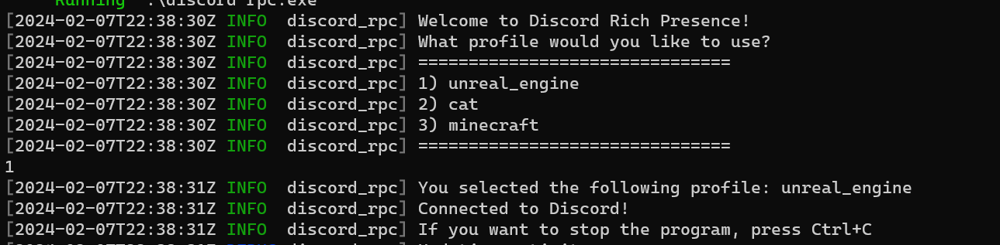
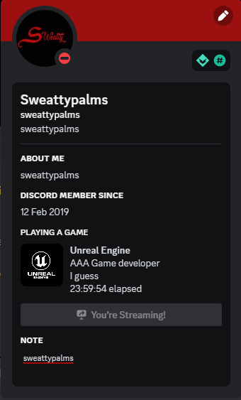

Simple discord rpc with an easy way to set the data.

You can make and use profiles to easily switch between different rpcs.

## Usage
```shell
discord-rpc.exe
```


## Example profile (Can add to the config file):
```toml
[profiles.example]
client_id = "<CLIENT-ID-HERE>"
large_image = "image-url"
large_text = "big-text"
small_image = "image-url"
small_text = "small-text"
details = "details"
state = "state"

# Can add more profiles
[profiles.example2]
client_id = "<CLIENT-ID-HERE>"
large_image = "image-url"
large_text = "big-text"
small_image = "image-url"
small_text = "small-text"
details = "details"
state = "state"
```

## Examples




# Credits
Main Developer: Sweattypalms,
Can contact me on discord: @sweattypalms

### Libraries used for rpc:
=> [discord rpc library (forked and modified)]( https://github.com/sardonicism-04/discord-rich-presence)